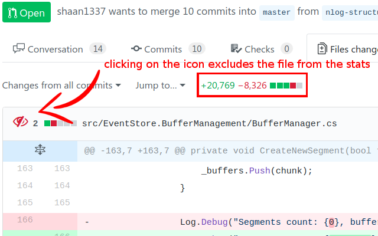

# Exclude files from diff stats on Github
Lightweight Google Chrome extension to exclude selected files from diff stats - [Download here](https://chrome.google.com/webstore/detail/exclude-files-from-diff-s/ligobjccihlhfnopajhfciioopidceic)

Sometimes unnecessary files get counted among the diff stats (such as vendor files or dependencies) clouding your view of the actual number of lines that need to be reviewed in a pull request or commit. With this Google Chrome extension, you can exclude any file from the line count by just clicking on the icon next to it!